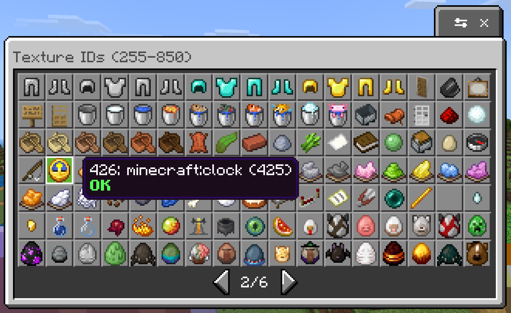
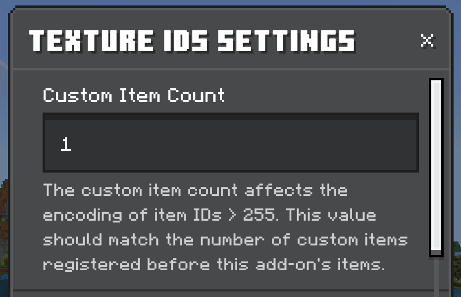
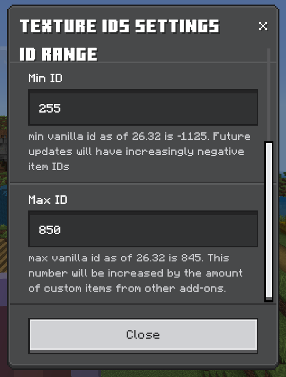

# Texture Debug

A Minecraft Bedrock add-on for debugging textures.

## Why This Add-On Exists

When creating add-ons that display item textures (like custom UIs, collection browsers, or inventory mods), you need to know the runtime texture ID for each item. The problem? **These IDs shift constantly based on which add-ons you have enabled.**

Minecraft assigns runtime IDs to items dynamically, and when multiple add-ons are active:

- Custom items get interleaved into the ID list, pushing vanilla item IDs around
- IDs above 256 get displaced by custom items
- Some vanilla items have stable negative IDs (like sulfur blocks at about -1125), but vanilla IDs above 256 get pushed around by custom items
- There's no reliable API to calculate the offset or interleaving pattern - you have to experimentally determine it

On top of this, existing documentation is incomplete and unreliable:

- Official Microsoft documentation is missing items (colored bundles, spears, and some other items don't appear anywhere)
- Third-party listings quickly become outdated with each Minecraft update
- There's no way to predict how IDs will change when Mojang adds new items
- This is a very bad developer experience (which I'm really surprised that a project under Microsoft wouldn't be given more developer UX love. After all, it was Ballmer that said "Developers, Developers, Developers!")

This add-on lets you **see the actual runtime texture ID mappings** in your specific world with your specific add-ons enabled, so you can correctly map namespaced item IDs to the textures the game actually renders.

Even if this add-on's hardcoded item ID list becomes outdated with a new Minecraft update, you can still use it to discover what's assigned to any integer you need. This helps:

- **Add-on developers** who need to render vanilla item textures in their custom UIs
- **Server/world maintainers** who need accurate texture mappings for add-on compatibility
- **Users of add-ons like Collect Everything!** who need settings to tweak ID assumptions so everything lines up correctly

## Features

- **Texture ID Browser**: Browse and inspect texture IDs with visual feedback
- **Debug Settings**: Configurable debug options including logging levels

## Requirements

- Minecraft Bedrock Edition (version 1.26.30 or higher)

## Installation

1. Download the `.mcaddon` file from CurseForge
2. Open it with Minecraft Bedrock or extract and install packs in your installation folder
3. Create or edit a world
4. Enable the add-on's resource pack either at the world level or the global level (enabling the resource pack should automatically enable the behavior pack, but double check just to make sure).

## Usage

### Texture Browser

Use the `/__debug_texture_ids` command in-game to access the texture browser. Requires admin privileges on the world.

Browse available textures and view their IDs for reference when creating add-ons.

### Texture Debug Settings

You can configure the range of integers rendered, as well as the
custom add-on items count to make the item descriptions line up. Use the settings button at the top of the texture browser to configure them.

## Troubleshooting

**Command not found**: Make sure the add-on is properly enabled in your world settings, and that you are at least Game Director permission level.

## Support

If you encounter issues, please report them on the CurseForge or GitHub page.

## License

MIT License - See [LICENSE](LICENSE) for details.

---

_For developers interested in the source code, see [Development.md](Development.md)._
