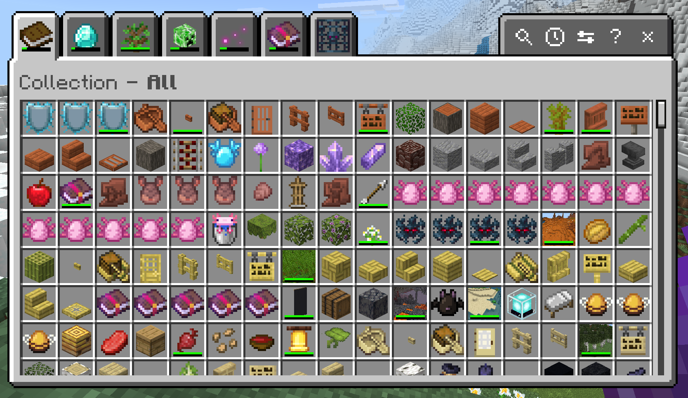
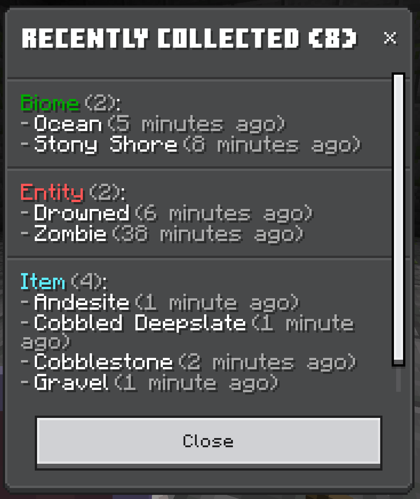
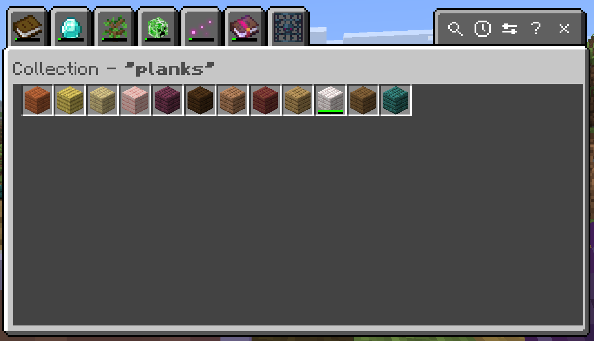
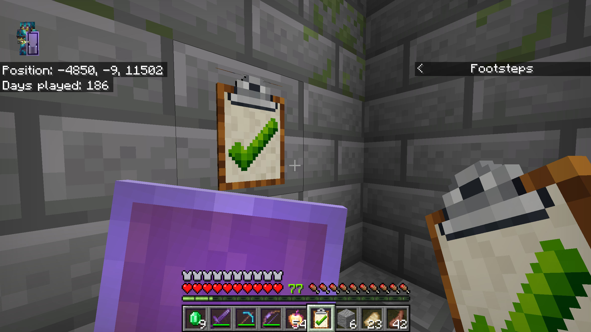
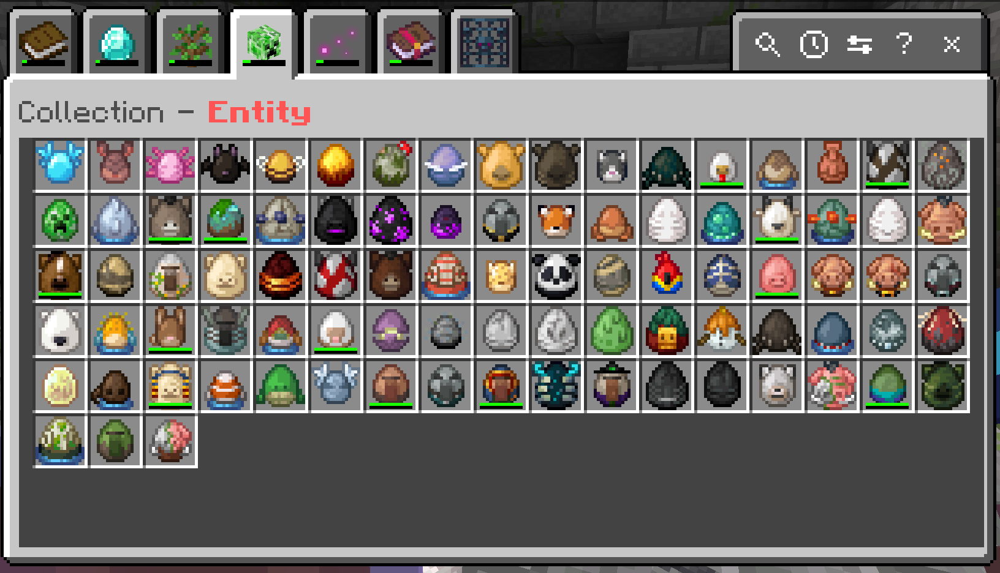
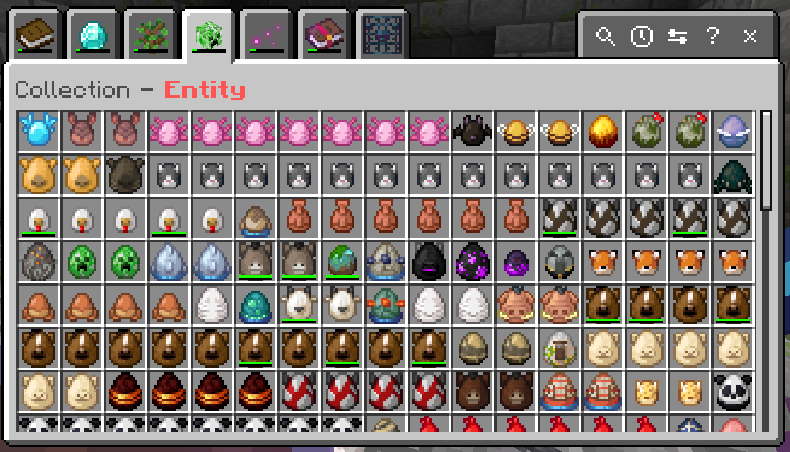
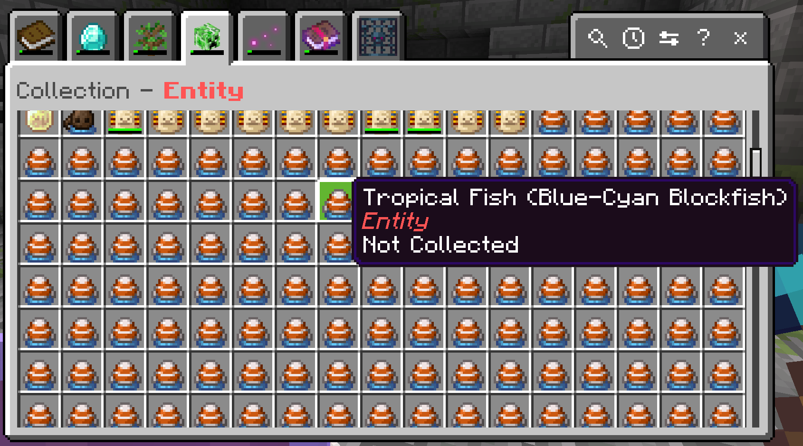

# Collect Everything! - Bedrock Add-On

Collect Everything! turns Minecraft Bedrock into a completionist's dream - a built-in compendium that automatically tracks every item, mob, biome, enchantment, effect, and unobtainable block you've ever touched. Browse your progress through a sleek tabbed UI with search, per-category completion stats, and session tracking. With support for entity variants (colors, professions, baby forms), all 60 biomes, and even cooperative Ender Dragon credit, it gives veteran players a brand-new reason to explore every corner of the world.

## How It Works

Collect Everything! tracks six categories of discoveries:

- **Items** - Pick up anything in survival, from diamond swords to suspicious stew, and watch everything get logged automatically.
- **Entities** - Kill, tame, or name, or leash a mob to add it to your collection. Each variant counts separately - try tracking down all 35 horse color-and-marking combos, every villager profession, and all five axolotl colors.
- **Biomes** - Just explore! Every new biome you set foot in is recorded. With over 60 biomes to discover, adventuring has never been more rewarding.
- **Effects** - Drink a potion, catch a lingering arrow, or eat suspicious stew to log each status effect. On harder difficulty settings, even each amplifier level counts.
- **Enchantments** - Enchant a tool, find an enchanted book, or trade with a villager to record the enchantment. Higher difficulties track each level separately.
- **Unobtainables** - Break a spawner, mine reinforced deepslate, or crack open a vault - blocks you can't normally get in survival are tracked here as a badge of honor.

## The Collection Browser

The collection browser is the star of the show - a sleek, tabbed interface that displays everything you've found with per-category progress bars, search, and a session view showing what you've collected in your current play session.

You can open it a few ways:

- Hold the **checklist item** in your hand and use it.
- Place the **checklist on a block** and interact with it.
- **Craft it yourself** with planks, paper, and any metal nugget (iron, gold, or copper).
- Or type **`/collecteverything:browse`** - no operator permissions required, and no cheats needed.

> **Power user tip:** bind `/collecteverything:browse` to a keyboard macro for one-button access to your collection.

## Difficulty Levels

Configure your difficulty right from the collection browser's settings modal (or via `/collecteverything:settings`). This controls how granular entity variant tracking is:

- **Basic** - One entry per entity type (e.g., just "horse"). Easiest to complete.
  
- **Committed** - Each variant dimension tracked independently (e.g., "horse+color:brown" and "horse+pattern:spotted" as separate entries). A solid middle ground.
  
- **Insane** - Every valid combination (e.g., 35 horse color/pattern combos, 2000+ tropical fish!). Only for the truly dedicated.
  

## Commands

All commands use the `collecteverything:` namespace and are available to any player with no operator permissions required. Keep your friends on their toes by running them anytime.

| Command                           | What it does                                                                            |
| --------------------------------- | --------------------------------------------------------------------------------------- |
| `/collecteverything:browse`       | Open the collection browser UI                                                          |
| `/collecteverything:stats`        | View per-category progress with counts and percentages                                  |
| `/collecteverything:all [filter]` | List everything in the game, highlighting what you've found (optional text filter)      |
| `/collecteverything:collected`    | List only what you've collected so far                                                  |
| `/collecteverything:uncollected`  | List what you still need to find                                                        |
| `/collecteverything:session`      | Show a summary of what you collected this session                                       |
| `/collecteverything:settings`     | Change your difficulty level                                                            |
| `/collecteverything:extra`        | Show items you've tracked that the add-on doesn't recognize (useful with other add-ons) |

### Admin commands

These require operator permissions:

| Command                               | What it does                                                                   |
| ------------------------------------- | ------------------------------------------------------------------------------ |
| `/collecteverything:_admin_settings`  | Open admin settings (world difficulty override, broadcast toggles, scoreboard) |
| `/collecteverything:_reset_all`       | Reset collection progress for ALL players                                      |
| `/collecteverything:__debug_settings` | Open the debug log configuration panel                                         |

## FAQ

**Is this Knarfy's Collect Everything mod from his YouTube videos?**

No, but it is inspired by his mod, and has his blessing. Developing for Bedrock is completely different than for Java Edition, so this is the spiritual twin of Knarfy's original mod, operating under the constraints that Bedrock has.

**Why aren't there as many categories as the Java version?**

The Java mod tracks Blocks, Structures, and Advancements - Bedrock's Script API doesn't expose structure detection (though the experimental `getGeneratedStructures()` API gives hope for the future), and Bedrock disables all advancements on worlds with custom behavior packs. For now, blocks are tracked under Items since Bedrock treats them the same way.

**Where's the fancy animated UI with 3D entity models?**

Bedrock add-ons have to run on everything from high-end PCs to mobile phones. The spawn egg icons and form-based browser keep things fast and lightweight across all devices - less compute, less storage. It's a trade-off we made intentionally so nobody gets left out.

**Where are the badge rewards?**

Coming soon! Awarding a trophy or badge for completing an entire category at a certain difficulty level is on the roadmap. Stay tuned.

**Can I share progress with friends like Java's Together mode?**

Not exactly - each player has their own personal collection. But that actually creates a fun dynamic: trade items, share discoveries, and help each other fill out your collections! It's more collaborative competition than shared progress.

**Why can't I use a keybind like Java's F11?**

You can! Bedrock lets keyboard users map custom macros using ALT+key combinations. Just wire up `/collecteverything:browse` to whatever combo you like in your settings. I personally use ALT+`~` - one tap and my collection is right there.

**Is there a leaderboard like the Java version?**

Kind of! The scoreboard sidebar shows each player's total collection count, so you can race your friends to see who can collect the most. Admins can toggle the scoreboard on or off in the admin settings panel.

**What about tropical fish and horse variants?**

Both are tracked! Tropical fish have all their color/pattern combinations, and horses track both color and markings. The difficulty setting (Basic/Committed/Insane) controls how granular it gets.

**Can I change my difficulty after I've started?**

Yes! Open the settings modal through the collection browser or `/collecteverything:settings`. You can switch anytime, and your existing progress adapts.

**Will this work with other add-ons?**

We've tried to make it compatible! Items from other add-ons will be tracked, but they'll show up with the unknown texture icon in the collection browser - Bedrock's APIs don't give us a way to render arbitrary item textures. We're looking into letting admins configure how those show up, so stay tuned.

**Is my progress saved if I leave the world?**

Absolutely. Everything is stored per-player via Bedrock's dynamic properties. No external files or databases needed.

**Can I contribute or suggest features?**

Yes! The project is open-source at [github.com/joeskeen/collect-everything-bedrock](https://github.com/joeskeen/collect-everything-bedrock). Issues, pull requests, and ideas are always welcome.

## Active Development

This add-on is actively being improved, fully open-source, and built with care for the community. Bugs are squashed quickly, and new features are always on the way. Contributions, ideas, and feedback are always welcome - head over to [github.com/joeskeen/collect-everything-bedrock](https://github.com/joeskeen/collect-everything-bedrock) to open an issue or submit a pull request. If you'd like to support the project directly, you can sponsor development at [github.com/sponsors/joeskeen](https://github.com/sponsors/joeskeen) - sponsors even get a special shout-out in an upcoming in-game easter egg!

## Shout-Outs

A massive shout-out to **Knarfy** for creating the original Collect Everything mod on Java Edition - this Bedrock port wouldn't exist without your brilliant idea. Go check out the original on [Modrinth](https://modrinth.com/mod/collect-everything) and follow along on YouTube ([@Knarfy](https://www.youtube.com/@Knarfy) and [@CollectEverythingMC](https://www.youtube.com/@CollectEverythingMC)).

And a huge thank-you to the **Bedrock Add-On community** - everyone who shares examples, answers questions in the Discord, and makes this ecosystem such an awesome place to create.
